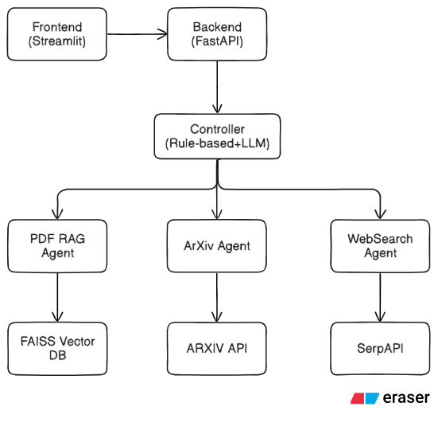

 # Multi-Agent System 🤖

<!-- Deployed Link: [Multi-Agent System Deployment](https://multi-agent-system-frontend.onrender.com) -->

A sophisticated multi-agent AI system that intelligently routes user queries to specialized agents for optimal answers. The system combines PDF processing, academic research, and web search capabilities with intelligent routing powered by Groq LLM.

<!-- 

## 🏢 Project Structure

```
multi_agent_system/
├── backend/                     # FastAPI Backend
│   ├── app/
│   │   ├── main.py             # FastAPI application entry
│   │   ├── api/                # API route handlers
│   │   │   ├── ask.py          # Main query processing
│   │   │   ├── upload.py       # PDF upload & status
│   │   │   └── logs.py         # System logs
│   │   ├── agents/             # Specialized AI agents
│   │   │   ├── controller.py   # Intelligent routing
│   │   │   ├── pdf_rag.py      # PDF document processing
│   │   │   ├── arxiv_agent.py  # Academic paper search
│   │   │   └── web_search.py   # Web search & synthesis
│   │   └── utils/              # Shared utilities
│   │       ├── logging_utils.py # Decision logging
│   │       ├── security.py     # Upload validation
│   │       └── backoff_utils.py # Retry mechanisms
│   ├── requirements.txt         # Python dependencies
│   ├── .env.example            # Environment template
│   └── data/                   # Data storage
│       ├── uploads/            # Uploaded PDFs
│       └── vectorstore/        # ChromaDB storage
├── frontend/                   # Streamlit Frontend
│   └── streamlit_app.py        # User interface
├── logs/                       # System logs
│   └── decision_logs.jsonl     # Agent routing decisions
└── README.md                   # This file
```
## 🏗️ System Architecture


## 🛠️ Technical Details

### Key Technologies

- **Backend Framework**: FastAPI (async/await, automatic OpenAPI docs)
- **Frontend**: Streamlit (rapid prototyping, file uploads)
- **LLM**: Groq (fast inference, multiple models)
- **Vector Database**: FAISS
- **Embeddings**: HuggingFace Transformers (local, no API costs)
- **PDF Processing**: PyMuPDF (fast, reliable text extraction)
- **Web Search**: SerpAPI (Google Search API)
- **Academic Search**: ArXiv API (open academic papers)

### Performance Optimizations

1. **Batch Processing**: Large PDFs processed in chunks to prevent hanging
2. **Async Processing**: Non-blocking API with background tasks
3. **Model Caching**: Embedding models cached for faster inference
4. **Connection Pooling**: Efficient database connections
5. **Retry Mechanisms**: Robust error handling with exponential backoff

## 🔧 Core Agents

#### 1. PDF RAG Agent 📄
- **Purpose**: Answer questions about uploaded PDF documents
- **Technology**: LangChain + ChromaDB + HuggingFace Embeddings
- **Features**:
  - PDF text extraction using PyMuPDF
  - Intelligent text chunking with overlap
  - Batch processing for large documents (prevents hanging)
  - Vector similarity search with metadata filtering
  - Document-specific or global PDF search


#### 2. ArXiv Research Agent 📚
- **Purpose**: Find and analyze recent academic papers
- **Technology**: ArXiv API + Groq LLM analysis
- **Features**:
  - Smart query preprocessing and field-specific search
  - Recent paper filtering (18-month window)
  - Comprehensive paper analysis with structured output
  - Research trend identification
  - Direct ArXiv links and paper recommendations


#### 3. Web Search Agent 🌐
- **Purpose**: Current information and general web queries
- **Technology**: SerpAPI (Google Search) + Groq LLM synthesis
- **Features**:
  - Real-time Google search results
  - Multi-source information synthesis
  - Structured answer generation
  - Source attribution and transparency


## 🔗 API Documentation

The system exposes a RESTful API with the following key endpoints:

### Core Endpoints

#### 1. Query Processing
**POST** `/ask/` - Process user queries and route to appropriate agents

Sample Request:
```json
{
    "text": "What are recent developments in AI safety?",
    "pdf_doc_id": "upload_1703123456",
    "prefer_agent": "ARXIV"
}
```

Sample Response:
```json
{
    "answer": "Recent developments in AI safety include constitutional AI methods, RLHF improvements, and robustness testing frameworks...",
    "agents_used": "ARXIV",
    "rationale": "User asked about recent papers in AI safety",
    "trace": {
        "papers": ["Paper 1", "Paper 2"],
        "query": "AI safety developments 2024",
        "llm_duration": 2.34
    }
}
```

#### 2. PDF Upload & Processing  
**POST** `/upload/` - Upload PDF documents for processing

Sample Response:
```json
{
    "status": "accepted",
    "doc_id": "upload_1703123456", 
    "filename": "research_paper.pdf",
    "check_status": "/upload/status/upload_1703123456"
}
```

#### 3. Upload Status Check
**GET** `/upload/status/{doc_id}` - Check processing status

Sample Response:
```json
{
    "status": "completed",
    "message": "Successfully ingested 45 chunks",
    "chunks_count": 45,
    "completed_at": 1703123456
}
```

## 🚀 Quick Start

### Prerequisites

- Python 3.8+
- API Keys:
  - [Groq API Key](https://console.groq.com) (Required)
  - [SerpAPI Key](https://serpapi.com) (Optional - for web search)

### Installation

1. **Clone the repository**
   ```bash
   git clone https://github.com/ayushchaware08/multi_agent_system.git
   cd multi_agent_system
   ```

2. **Set up virtual environment**
   ```bash
   python -m venv venv
   source venv/bin/activate  # On Windows: venv\\Scripts\\activate
   ```

3. **Install dependencies**
   ```bash
   cd backend
   pip install -r requirements.txt
   ```

4. **Configure environment**
   ```bash
   cp .env.example .env
   # Edit .env file with your API keys
   ```

5. **Create required directories**
   ```bash
   mkdir -p data/uploads data/vectorstore logs
   ```

### Running the System

#### Option 1: Full System (Recommended)

1. **Start Backend**
   ```bash
   cd backend
   uvicorn app.main:app --reload --host 0.0.0.0 --port 8000
   ```

2. **Start Frontend** (New terminal)
   ```bash
   cd frontend
   streamlit run streamlit_app.py
   ```

## 📝 Environment Configuration

Create a `.env` file in the `backend` directory:

```bash
GROQ_API_KEY=your_groq_api_key_here
SERPAPI_API_KEY=your_serpapi_key_here
CHROMA_DB_DIR=data/vectorstore
MAX_UPLOAD_MB=10
LOG_FILE=logs/decision_logs.jsonl
FASTAPI_HOST=0.0.0.0
FASTAPI_PORT=8000
``` 
-->

<!-- ## 🔗 API Documentation

### Core Endpoints

#### 1. Query Processing
```http
POST /ask/
Content-Type: application/json

{
  "text": "What are recent developments in AI safety?",
  "pdf_doc_id": "optional_document_id",
  "prefer_agent": "ARXIV"  // Optional: PDF_RAG, ARXIV, WEB_SEARCH
}

Response:
{
  "answer": "Detailed AI-generated response...",
  "agents_used": "ARXIV",
  "rationale": "User asked about recent papers",
  "trace": {
    "papers": [...],
    "query": "...",
    "llm_duration": 2.34
  }
}
```

#### 2. PDF Upload & Processing
```http
POST /upload/
Content-Type: multipart/form-data

FormData: file=@document.pdf

Response:
{
  "status": "accepted",
  "doc_id": "upload_1703123456",
  "filename": "document.pdf",
  "check_status": "/upload/status/upload_1703123456"
}
```

#### 3. Upload Status Check
```http
GET /upload/status/{doc_id}

Response:
{
  "status": "completed",  // processing, completed, failed
  "message": "Successfully ingested 45 chunks",
  "chunks_count": 45,
  "completed_at": 1703123456
}
```

#### 4. System Health
```http
GET /health

Response:
{
  "status": "healthy",
  "embedding_model": "loaded"
}
``` -->

<!-- ### Additional Endpoints

- `GET /upload/list` - List all uploaded documents
- `DELETE /upload/{doc_id}` - Delete uploaded document
- `GET /logs/` - View system decision logs
- `DELETE /upload/clear-failed` - Clear failed uploads 

## 🎯 Usage Examples

### 1. Academic Research
```
Query: "recent papers on transformer architectures in 2025"
→ Routes to ArXiv Agent
→ Returns: Latest papers with analysis and recommendations
```

### 2. PDF Document Analysis
```
1. Upload PDF via frontend or API
2. Query: "What are the main conclusions of the uploaded document?"
→ Routes to PDF RAG Agent
→ Returns: Document-specific insights with source citations
```

### 3. Current Information
```
Query: "What happened in the tech industry this week?"
→ Routes to Web Search Agent  
→ Returns: Latest news with multiple source synthesis
```

### 4. Mixed Queries
```
Query: "Compare recent AI safety papers with regulations mentioned in my uploaded policy document"
→ Controller intelligently routes to multiple agents
→ Returns: Comprehensive analysis from multiple sources
```

## 🚀 Deployment
Production Deployment on Render
This application is deployed on Render with separate services for backend and frontend.

Live Demo
- Backend API: https://multi-agent-backend-n3bp.onrender.com
- Frontend UI: https://multi-agent-system-frontend.onrender.com


## 📄 License

MIT License - see [LICENSE](LICENSE) file for details.

**Made by [ayushchaware08](https://github.com/ayushchaware08)**
-->